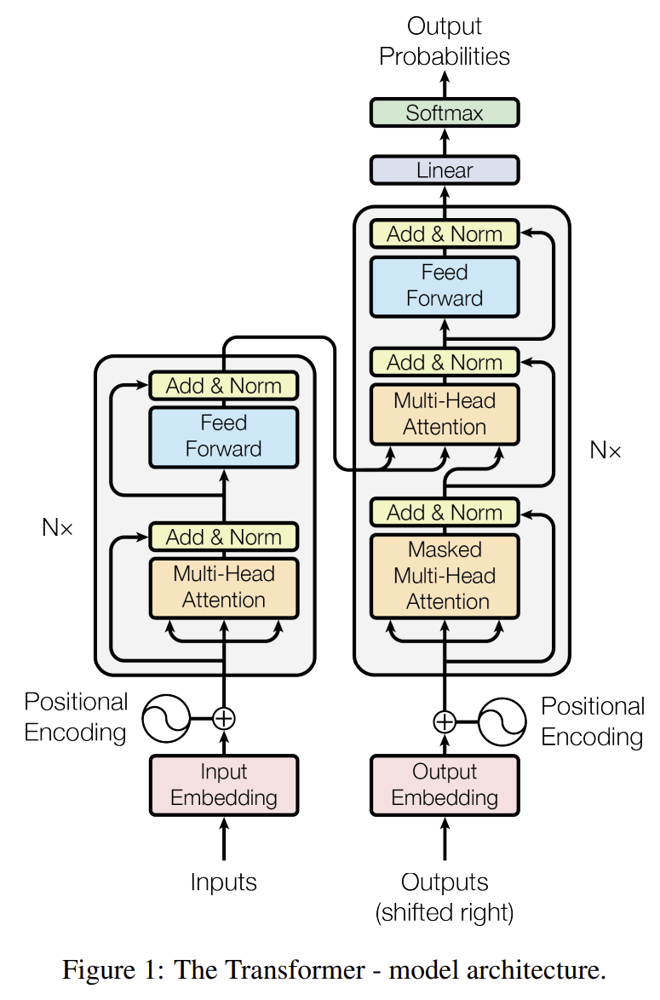
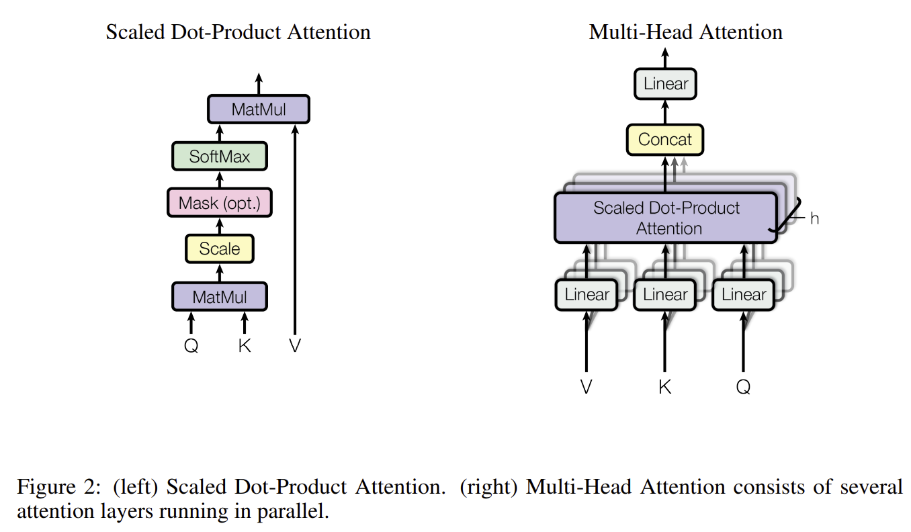
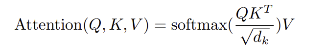

# Attention Is All You Need
This is the paper presentation repo for "Attention Is All You Need".

## Overview

1. The paper proposes a new network architecture, the Transformer, based solyely on attention mechanisms. The Transformer is more parallelizable and require less time to train (WMT).
2. The Transformer contains Encoder and Decoder parts. Each of them contaions 6 identical layers.
3. For Encoder, each layer has 2 sub-layers. The first is a multi-head self-attention mechanism, and the second is a simple, position-wise fully connected feed forward network.
4. The Decorder is also composed of 6 identical layers. In addition to the two sub-layers in each encoder layer, the decoder inserts a third sub-layer, which performs multi-head attion over the output of the encorder stack.
5. An attention function can be described as mapping a query and a set of key-value pairs to an output, where the query, keys, values, and output are all vectors. The Transformer model in this paper uses the "Scaled Dot-Product Attention".

### The picture in this paper

  

## Discussion Topic 1

Why the Masked Multi-Head Attention need to have “Masked”?

## Discussion Topic 2

Why there is Multi-Head Attention?

## Discussion Topic 3

Why there is attention?

## Critical Analysis

1. The paper poposed a new mdoel architecture and it is only implemented in the translation. 
2. I think the every part in the transformer could be explained in a more detailed way.
3. The transformer contains 2 parts in this paper. But they can also be used in a seperate way, which are BERT and GPT.
4. I think the attention mechanism could make the deep learning model more explainable.

## Resource links

1. Original Article: https://arxiv.org/abs/1706.03762v5
2. Tensor2Tensor has some code with a tutorial: https://www.tensorflow.org/text/tutorials/transformer
3. Transformer very intuitively explained: http://jalammar.github.io/illustrated-transformer/

## Code demonstration

The link of the notebook: https://colab.research.google.com/github/bentrevett/pytorch-seq2seq/blob/master/6%20-%20Attention%20is%20All%20You%20Need.ipynb#scrollTo=8hOLjW7rJKJL

## Video Recording

Link to video recording.
